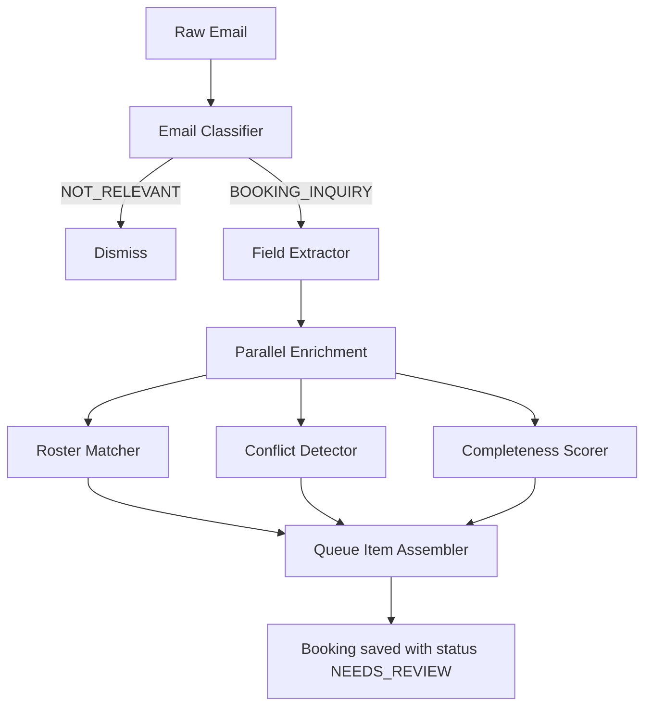
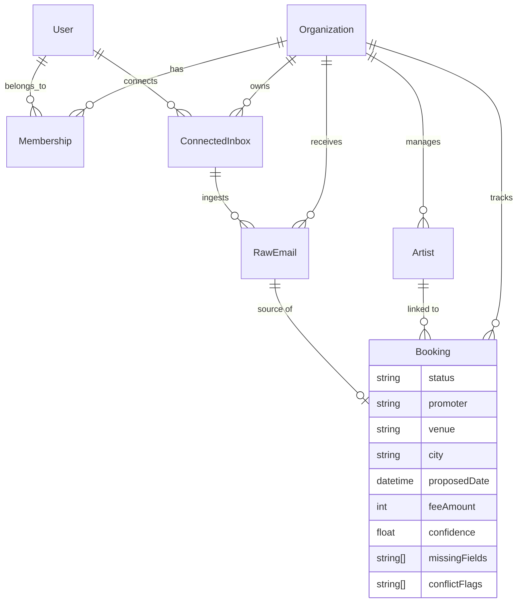

# Overbook

**AI-powered booking management platform for music agencies.**

Overbook automates the chaotic workflow of managing live-music bookings — from the moment an offer lands in your inbox to confirmed show on the calendar. Built as a multi-agent system on [Google ADK](https://adk.dev), it classifies inbound emails, extracts deal terms, detects calendar conflicts, and assembles structured booking records — all before a human ever touches it.


---

## Why Overbook?

A booking agent at a music agency juggles hundreds of inbound offers per week across email threads, spreadsheets, and calendars. Overbook collapses that into a single pipeline:

1. **Email arrives** → Nylas webhook fires
2. **AI classifies** → Is this a booking inquiry or noise?
3. **Fields extracted** → Artist, venue, date, fee, promoter — structured automatically
4. **Enrichment runs in parallel** → Roster matching, calendar conflict detection, data completeness scoring
5. **Booking record created** → Ready for human review in the dashboard

No copy-paste. No missed offers. No double-bookings.

---

## Architecture

```
┌─────────────────────────────────────────────────────────────────┐
│                        packages/www                             │
│              Next.js 16 · React 19 · Clerk Auth                 │
│         Dashboard, Roster Management, Booking Views             │
└──────────────────────────┬──────────────────────────────────────┘
                           │ GraphQL (Apollo Client)
┌──────────────────────────▼──────────────────────────────────────┐
│                        packages/api                             │
│            Express 5 · Apollo Server · Pothos                   │
│     GraphQL API · Nylas Webhooks · Clerk Webhooks · OAuth       │
└──────┬──────────────────────────────────────┬───────────────────┘
       │                                      │
       ▼                                      ▼
┌──────────────┐                 ┌────────────────────────────────┐
│ packages/db  │                 │       packages/agents          │
│ Prisma 7     │◄────────────────│       Google ADK 1.5           │
│ PostgreSQL   │  reads/writes   │  9 Agents · 3 Workflows       │
└──────────────┘                 │  Gemini 2.5 Flash              │
                                 └────────────────────────────────┘
```

### Monorepo Packages

| Package | Description |
|---------|-------------|
| **`packages/agents`** | AI agent orchestration — classification, extraction, enrichment, and booking assembly via Google ADK |
| **`packages/api`** | GraphQL API, webhook handlers (Clerk + Nylas), OAuth flows |
| **`packages/db`** | Prisma schema, migrations, and database client for PostgreSQL |
| **`packages/www`** | Next.js frontend — marketing site, auth, and agency dashboard |

---

## Agent System

The core of Overbook is a multi-agent pipeline built on [Google Agent Development Kit (ADK)](https://adk.dev). Each agent is a focused specialist that handles one job well. Agents are composed into three workflows that cover the full booking lifecycle.

### Workflows

#### 1. Inbound Processor

The main pipeline — turns a raw email into a structured, enriched booking record.



#### 2. Queue Action Handler

Handles human decisions on queued bookings — capture, pencil-hold, request more info, dismiss, or route to a teammate.

#### 3. Booking Coordinator

Manages the active booking lifecycle using a collaborative multi-agent pattern. Delegates to calendar, email drafting, and status tracking sub-agents.

### Agent Roster

| Agent | Purpose |
|-------|---------|
| **Email Classifier** | Categorises inbound email as `BOOKING_INQUIRY`, `NOT_RELEVANT`, or `AMBIGUOUS` |
| **Field Extractor** | Pulls structured fields from email body — artist, venue, date, fee, promoter, terms |
| **Roster Matcher** | Fuzzy-matches extracted artist name against the agency's roster with confidence scoring |
| **Conflict Detector** | Checks the artist's calendar for conflicts within ±14 days of the proposed date |
| **Completeness Scorer** | Scores data quality 0–1 and flags missing critical vs. optional fields |
| **Queue Item Assembler** | Merges all enrichment outputs and persists the booking to the database |
| **Booking Capture** | Converts a reviewed queue item into a confirmed booking record |
| **Draft Reply** | Generates contextual email replies (e.g., requesting missing info from a promoter) |
| **Calendar Preview** | Provides a calendar snapshot around a proposed booking date |

### Tools

Agents interact with the system through typed function tools:

- **`saveBookingTool`** — Persists enriched booking data to PostgreSQL
- **`lookupRosterTool`** — Searches the agency's artist roster
- **`checkCalendarTool`** / **`getArtistCalendarTool`** — Calendar conflict queries
- **`draftEmailTool`** — Composes reply drafts

All agent I/O is validated with **Zod** schemas — `ExtractedOfferSchema`, `ConflictReportSchema`, `CompletenessReportSchema`, `RosterMatchSchema`, `BookingSchema`, etc.

---

## Data Model

Multi-tenant by design — every record is scoped to an organization.



**Booking statuses:** `INBOX` → `NEEDS_REVIEW` → `PENCILLED` → `SENT_TO_ARTIST` → `APPROVED` → `CONFIRMED` → `CONTRACTED` → `DECLINED` / `LOST`

**Key design decisions:**
- Fees stored in minor units (cents) for precision
- `RawEmail` is immutable — the original source is always preserved
- Core typed columns + a JSON `details` field for forward compatibility
- Booking `confidence` score (0–1) set by the AI pipeline

---

## Tech Stack

| Layer | Technology |
|-------|-----------|
| **AI Agents** | [Google ADK](https://adk.dev) 1.5, Gemini 2.5 Flash |
| **Frontend** | Next.js 16, React 19, Tailwind CSS 4, shadcn/ui |
| **API** | Express 5, Apollo Server, Pothos (GraphQL) |
| **Auth** | Clerk (multi-tenant orgs, roles, webhooks) |
| **Email** | Nylas (OAuth inbox connection, webhook ingestion) |
| **Database** | PostgreSQL, Prisma 7 |
| **Validation** | Zod |
| **Language** | TypeScript throughout |
| **Monorepo** | pnpm workspaces |

---

## Project Structure

```
overbook/
├── packages/
│   ├── agents/          # Google ADK agent definitions & workflows
│   │   └── src/
│   │       ├── agents/  # 9 specialist agents
│   │       ├── schemas/ # Zod schemas for agent I/O
│   │       ├── tools/   # Function tools (DB, calendar, email, roster)
│   │       └── workflows/ # Inbound processor, queue actions, booking coordinator
│   ├── api/             # Backend API
│   │   └── src/
│   │       ├── graphql/ # Pothos schema builder & context
│   │       ├── modules/ # artist, booking, email-intake (types/resolvers/services)
│   │       ├── routes/  # Nylas OAuth
│   │       ├── services/# Nylas SDK
│   │       └── webhooks/# Clerk & Nylas webhook handlers
│   ├── db/              # Database
│   │   └── prisma/      # Schema, migrations, seed
│   └── www/             # Frontend
│       └── src/
│           ├── app/     # Next.js routes (marketing, auth, dashboard)
│           └── components/ # UI components (shadcn/ui + custom)
└── docs/                # Architecture plans & specs
```

---

## Getting Started

### Prerequisites

- Node.js 20+
- pnpm 9+
- PostgreSQL
- Clerk account (auth)
- Nylas account (email integration)
- Google AI API key (Gemini)

### Setup

```bash
# Clone the repo
git clone https://github.com/malimccalla/overbook.git
cd overbook

# Install dependencies
pnpm install

# Set up environment variables (see .env.example in each package)

# Run database migrations
pnpm --filter @overbook/db prisma migrate dev

# Start development
pnpm --filter @overbook/api dev    # API on :4000
pnpm --filter @overbook/www dev    # Frontend on :3000
```

---

## License

MIT
