# Korda V1 — Agent Architecture

## Workflow choice: ADK Graph-based Workflow

ADK 2.0 (Python v2.0.0+) introduces **graph-based workflows** using the `Workflow` class with `edges`. This supersedes the legacy `SequentialAgent` used in the current codebase and is the recommended pattern going forward. Graph workflows give us:

- **Conditional routing** — classify emails and branch on the result
- **Fan-out / join** — run roster matching, conflict detection, and completeness scoring in parallel via `JoinNode`
- **Mixed node types** — alternate between LLM agents and deterministic function nodes in the same graph
- **Nested workflows** — compose the inbound pipeline and queue-action pipeline as reusable sub-graphs

> **Upgrade required:** `pyproject.toml` must bump `google-adk>=1.3.0` → `google-adk>=2.0.0`

---

## System overview

Three workflows cover the full Korda V1 lifecycle:

| # | Workflow | Pattern | Trigger |
|---|---|---|---|
| 1 | `korda_inbound_workflow` | Graph-based `Workflow` | New inbound email arrives |
| 2 | `korda_queue_action_workflow` | Graph-based `Workflow` | Agent takes action on a queue item |
| 3 | `booking_coordinator` | Collaborative `Agent` (coordinator) | Agent opens an active booking |

---

## Architecture diagram

```mermaid
graph TD
    subgraph W1["Workflow 1 · Inbound Processor"]
        A([START: raw email]) --> B[email_classifier_agent]
        B --> R1{classify_router}
        R1 -->|BOOKING_INQUIRY\nAMBIGUOUS| C[field_extractor_agent]
        R1 -->|NOT_RELEVANT| Z[dismiss_function]
        C --> D[roster_matcher_agent]
        C --> E[conflict_detector_agent]
        C --> F[completeness_scorer_agent]
        D --> J[JoinNode: enrichment_join]
        E --> J
        F --> J
        J --> G[queue_item_assembler_agent]
    end

    subgraph W2["Workflow 2 · Queue Action"]
        H([START: queue item + action]) --> V[validate_action_fn]
        V --> R2{action_router}
        R2 -->|CAPTURE / PENCIL| I[booking_capture_agent]
        I --> K[calendar_preview_agent]
        R2 -->|REQUEST_INFO| L[draft_reply_agent]
        R2 -->|DISMISS| M[update_status_fn]
        R2 -->|ROUTE| N[route_to_desk_fn]
    end

    subgraph W3["Workflow 3 · Booking Coordinator"]
        O[booking_coordinator] -->|delegates| P[calendar_preview_agent]
        O -->|delegates| Q[draft_reply_agent]
        O -->|delegates| S[status_tracker_agent]
    end
```



---

## The agent team (9 agents)

### Workflow 1: Inbound processor

| Agent | Mode | Responsibility | Output schema |
|---|---|---|---|
| `email_classifier_agent` | `single_turn` | Reads the raw email and classifies it | `ClassificationResult` |
| `field_extractor_agent` | `single_turn` | Extracts structured offer fields from the email body | `ExtractedOffer` |
| `roster_matcher_agent` | `single_turn` | Matches the offer to a roster artist — runs **in parallel** | `RosterMatch` |
| `conflict_detector_agent` | `single_turn` | Checks proposed date against artist calendar — runs **in parallel** | `ConflictReport` |
| `completeness_scorer_agent` | `single_turn` | Scores data quality, flags missing fields — runs **in parallel** | `CompletenessReport` |
| `queue_item_assembler_agent` | `single_turn` | Merges all enrichment results into a final queue item, calls `save_queue_item_tool` | `QueueItem` |

### Workflow 2: Queue action

| Agent | Mode | Responsibility | Output schema |
|---|---|---|---|
| `booking_capture_agent` | `single_turn` | Creates a `Booking` record from a captured/pencilled queue item | `Booking` |
| `draft_reply_agent` | `task` | Drafts a context-aware email reply; can ask the user clarifying questions | — |
| `calendar_preview_agent` | `single_turn` | Generates a visual calendar placement for the proposed date | `CalendarPreview` |

### Workflow 3: Booking coordinator

| Agent | Mode | Responsibility |
|---|---|---|
| `booking_coordinator` | coordinator | Handles the active booking lifecycle; delegates to sub-agents |
| `calendar_preview_agent` | `single_turn` | Sub-agent: calendar preview on demand |
| `draft_reply_agent` | `task` | Sub-agent: draft replies with clarification capability |
| `status_tracker_agent` | `single_turn` | Sub-agent: updates booking status fields |

> **Note on `task` mode:** In ADK Python 2.0.0, `mode="task"` is **disabled inside graph nodes** but is valid as a sub-agent in the collaborative coordinator context. `draft_reply_agent` uses `single_turn` when placed directly in the W2 graph, and `task` when invoked by `booking_coordinator`.

---

## Graph wiring

### Workflow 1: Inbound processor

```python
from google.adk import Workflow
from google.adk.workflow import JoinNode

enrichment_join = JoinNode(name="enrichment_join")

korda_inbound_workflow = Workflow(
    name="korda_inbound_workflow",
    edges=[
        ("START", email_classifier_agent, classify_router),
        (classify_router, {
            "BOOKING_INQUIRY": field_extractor_agent,
            "AMBIGUOUS":       field_extractor_agent,
            "NOT_RELEVANT":    dismiss_function,
        }),
        # fan-out: three agents run in parallel from field_extractor_agent
        (field_extractor_agent, roster_matcher_agent,     enrichment_join),
        (field_extractor_agent, conflict_detector_agent,  enrichment_join),
        (field_extractor_agent, completeness_scorer_agent, enrichment_join),
        # join: assembler receives all three results
        (enrichment_join, queue_item_assembler_agent),
    ],
)
```

### Workflow 2: Queue action

```python
korda_queue_action_workflow = Workflow(
    name="korda_queue_action_workflow",
    edges=[
        ("START", validate_action_fn, action_router),
        (action_router, {
            "CAPTURE":      booking_capture_agent,
            "PENCIL":       booking_capture_agent,
            "REQUEST_INFO": draft_reply_agent,
            "DISMISS":      update_status_fn,
            "ROUTE":        route_to_desk_fn,
        }),
        (booking_capture_agent, calendar_preview_agent),
    ],
)
```

### Workflow 3: Booking coordinator (collaborative pattern)

```python
from google.adk import Agent

booking_coordinator = Agent(
    name="booking_coordinator",
    model="gemini-flash-latest",
    instruction="...",
    # ADK auto-injects delegation tools named after each sub-agent
    sub_agents=[
        calendar_preview_agent,  # mode="single_turn"
        draft_reply_agent,       # mode="task"
        status_tracker_agent,    # mode="single_turn"
    ],
)
```

---

## Data schemas (Pydantic)

All data contracts between nodes use `input_schema` / `output_schema` on each `Agent`.

```python
# schemas/offers.py
class ClassificationResult(BaseModel):
    category: Literal["BOOKING_INQUIRY", "NOT_RELEVANT", "AMBIGUOUS"]
    confidence: float
    reasoning: str

class ExtractedOffer(BaseModel):
    artist_name: str | None
    promoter: str | None
    venue: str | None
    proposed_date: str | None       # ISO 8601
    city: str | None
    fee: str | None
    hold_status: str | None
    travel_notes: str | None
    offer_terms: list[str]
    missing_fields: list[str]
    raw_email_excerpt: str

class QueueItemStatus(str, Enum):
    NEEDS_REVIEW = "NEEDS_REVIEW"
    DISMISSED = "DISMISSED"
    INFO_REQUESTED = "INFO_REQUESTED"
    ROUTED = "ROUTED"
    CAPTURED = "CAPTURED"

class QueueItem(BaseModel):
    id: str
    source_email_id: str
    suggested_artist: str | None
    artist_id: str | None
    promoter: str | None
    venue: str | None
    proposed_date: str | None
    city: str | None
    fee: str | None
    status: QueueItemStatus
    confidence: float
    missing_fields: list[str]
    conflict_flags: list[str]
    recommended_next_action: str
    created_at: str                 # ISO 8601

# schemas/roster.py
class RosterMatch(BaseModel):
    matched_artist_id: str | None
    matched_artist_name: str | None
    confidence: float
    alternatives: list[dict]

# schemas/enrichment.py
class ConflictReport(BaseModel):
    has_conflict: bool
    conflict_type: str | None       # DATE_CONFLICT | ROUTING_CONCERN | RADIUS_CLAUSE
    conflicting_dates: list[str]
    routing_concern: str | None

class CompletenessReport(BaseModel):
    overall_confidence: float
    missing_critical_fields: list[str]
    missing_optional_fields: list[str]
    flags: list[str]

class CalendarPreview(BaseModel):
    artist_id: str
    proposed_date: str
    existing_dates: list[dict]
    has_conflict: bool

# schemas/bookings.py
class BookingStatus(str, Enum):
    CAPTURED = "CAPTURED"
    AWAITING_REPLY = "AWAITING_REPLY"
    IN_NEGOTIATION = "IN_NEGOTIATION"
    PENCILLED = "PENCILLED"
    AWAITING_ARTIST = "AWAITING_ARTIST"
    AWAITING_PROMOTER = "AWAITING_PROMOTER"
    CONTRACT_REQUESTED = "CONTRACT_REQUESTED"
    CONTRACT_RECEIVED = "CONTRACT_RECEIVED"
    CONFIRMED = "CONFIRMED"
    LOST = "LOST"

class Booking(BaseModel):
    id: str
    queue_item_id: str
    artist_id: str
    promoter: str | None
    venue: str | None
    date: str | None
    city: str | None
    fee: str | None
    status: BookingStatus
    notes: str
    captured_at: str                # ISO 8601
```

---

## Proposed file structure

```
schemas/
  __init__.py
  offers.py               ← ClassificationResult, ExtractedOffer, QueueItem
  bookings.py             ← Booking, BookingStatus
  roster.py               ← RosterMatch, ArtistRecord
  enrichment.py           ← ConflictReport, CompletenessReport, CalendarPreview

agents/
  inbound_processor/
    __init__.py
    workflow.py           ← Workflow edges + JoinNode definition
    classifier/
      __init__.py
      agent.py            ← email_classifier_agent
    extractor/
      __init__.py
      agent.py            ← field_extractor_agent
    enrichment/
      __init__.py
      roster_matcher/
        __init__.py
        agent.py          ← roster_matcher_agent  (single_turn, parallel)
      conflict_detector/
        __init__.py
        agent.py          ← conflict_detector_agent  (single_turn, parallel)
      completeness_scorer/
        __init__.py
        agent.py          ← completeness_scorer_agent  (single_turn, parallel)
    assembler/
      __init__.py
      agent.py            ← queue_item_assembler_agent

  queue_actions/
    __init__.py
    workflow.py           ← Queue action Workflow edges
    booking_capture/
      __init__.py
      agent.py            ← booking_capture_agent
    draft_reply/
      __init__.py
      agent.py            ← draft_reply_agent
    calendar_preview/
      __init__.py
      agent.py            ← calendar_preview_agent

  booking_coordinator/
    __init__.py
    agent.py              ← booking_coordinator (collaborative, sub_agents)
    status_tracker/
      __init__.py
      agent.py            ← status_tracker_agent  (single_turn)

tools/
  roster_tools.py         ← lookup_roster_tool  (stub → real DB later)
  calendar_tools.py       ← check_calendar_tool, get_artist_calendar_tool
  booking_tools.py        ← create_booking_tool, save_queue_item_tool
  email_tools.py          ← draft_email_tool
```

---

## Function nodes (deterministic code, no LLM)

| Node | Returns | Logic |
|---|---|---|
| `classify_router` | `Event(route="BOOKING_INQUIRY"\|"NOT_RELEVANT"\|"AMBIGUOUS")` | Reads `ClassificationResult.category` |
| `dismiss_function` | `Event(message="Email marked not relevant")` | Updates email record status |
| `validate_action_fn` | `Event(output=validated_action)` | Guards invalid state transitions |
| `action_router` | `Event(route="CAPTURE"\|"PENCIL"\|"REQUEST_INFO"\|"DISMISS"\|"ROUTE")` | Reads agent-selected action |
| `update_status_fn` | `Event(message="Queue item dismissed")` | Sets `QueueItem.status = DISMISSED` |
| `route_to_desk_fn` | `Event(message="Routed to {desk}")` | Assigns queue item to a team member |

---

## State lifecycle

### Queue item

```
DETECTED → ENRICHED → NEEDS_REVIEW
  → DISMISSED
  → INFO_REQUESTED
  → ROUTED
  → CAPTURED  ←── triggers Booking creation
```

### Booking

```
CAPTURED → AWAITING_REPLY → IN_NEGOTIATION → PENCILLED
  → AWAITING_ARTIST → AWAITING_PROMOTER
  → CONTRACT_REQUESTED → CONTRACT_RECEIVED
  → CONFIRMED
  → LOST
```

---

## Implementation notes

1. **Stub tools first** — implement all tools in `tools/` as stubs returning mock data. This lets every agent be developed and tested before real database or email integrations exist.

2. **`JoinNode` failsafe** — each of the three parallel enrichment agents must always emit `Event(output=...)`, even on error, or the `JoinNode` will stall. Wrap extraction logic with a try/except that returns a safe default.

3. **`draft_reply_agent` mode** — use `mode="single_turn"` when it is a direct node in `korda_queue_action_workflow`; use `mode="task"` only when it is a sub-agent of `booking_coordinator`. The same agent definition can be reused in both contexts — the runtime determines control flow from how it was invoked.

4. **Human-in-the-loop** — ADK 2.0 supports pausing a graph at a `HumanInputNode` (`adk.dev/graphs/human-input/`). The queue review step in W2 is a candidate for this rather than terminating W1 and starting W2 as a separate invocation.

5. **`adk web` entrypoint** — expose `korda_inbound_workflow`, `korda_queue_action_workflow`, and `booking_coordinator` as top-level agents so they all appear in the ADK web UI.
